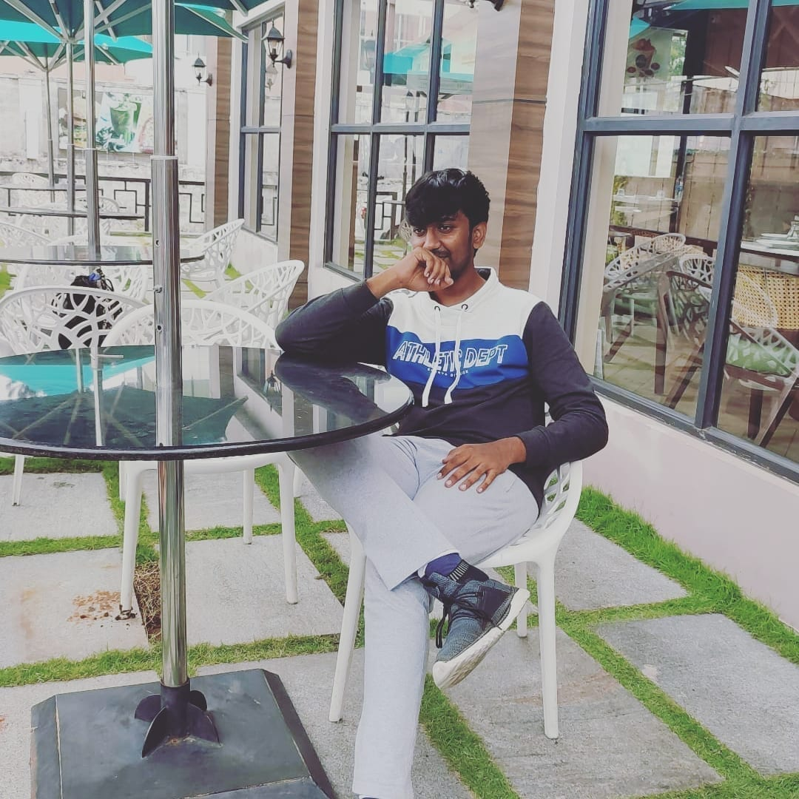

<!DOCTYPE html>
<html lang="en">
<head>
    <title>Kabil Pranav K ~ Portfolio</title>
    <link rel="stylesheet" href="portfolio.css">
    <link rel="stylesheet" href="https://cdnjs.cloudflare.com/ajax/libs/font-awesome/6.5.1/css/all.min.css" integrity="sha512-DTOQO9RWCH3ppGqcWaEA1BIZOC6xxalwEsw9c2QQeAIftl+Vegovlnee1c9QX4TctnWMn13TZye+giMm8e2LwA==" crossorigin="anonymous" referrerpolicy="no-referrer" />
    <link rel="icon" href="zyxf5OP.png">
    
</head>
<body>
    
    

        

            <pre>Kabil's Portfolio</pre>
            

                <a href="https://github.com/Kabil-Pranav-K" class="t"> <i class="fa-brands fa-github"></i></a>
                <a href="https://www.linkedin.com/in/kabil-pranav-k-982b55217/" class="t"><i class="fa-brands fa-linkedin"></i></a>
                <a href="https://www.instagram.com/kabil_pranav_k/" class="t"><i class="fa-brands fa-instagram"></i></a>
            

        

    

    
    

        <ul>
            
I am,
 
            
Kabil Pranav K

             
            
Developer | Passionate Coder | Seeking Intern

             
            <a href="https://www.amrita.edu/" class="clg">Student at Amrita Vishwa Vidyapeetham</a>
        </ul>
        
    

    
Services I Provide

    
    

        

            <i class="fa-brands fa-html5 icon"></i>
            
Web Development

            
Web Page | Hosting | Contact Forms

            
As a Full stack Developer I am well versed 
                 in html/css, react and javascript. Click on 
                 the button below to view my porjects.
            

            <button type="button" class="vp"> 
                <a class="b1" href="file:///C:/Htmlcss/first.html">View Projects</a>
            </button>
        

        

            <i class="fa-brands fa-python py"></i>
            
Python

            
Machine learning | Digital Image Processing | Kivy

            
I am well versed in Python programming.  
               Machine learning, kivy and Digital Image Processing  
               are the techniques I am well aware of.

            <button type="button" class="vp"> 
                <a class="b1" href="file:///C:/Htmlcss/first.html">View Projects</a>
            </button>
        

        

            <i class="fa-solid fa-c cicon"></i>
            
C Program

            
C | Embedded C

            
I am well versed in C programming.  
               And I know Embedded C program as well 
               LPC2148 and MSP432 are the microcontroller  
               in which I have done the Embedded C programming.

            <button type="button" class="vp"> 
                <a class="b1" href="file:///C:/Htmlcss/first.html">View Projects</a>
            </button>
        

    

</body>
</html>
